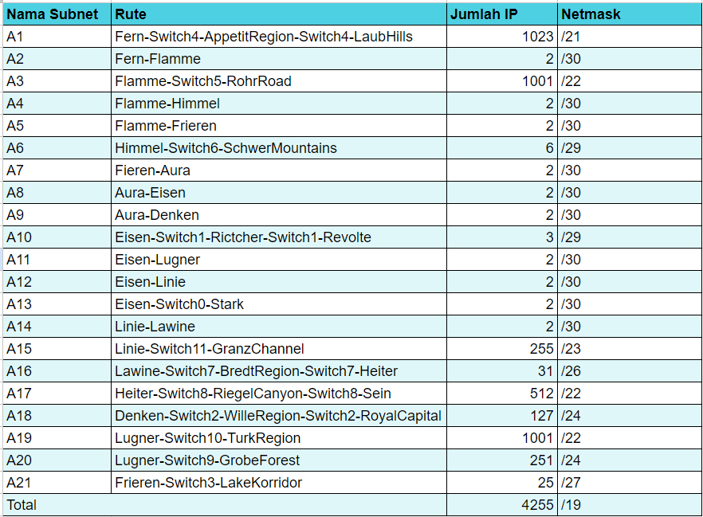
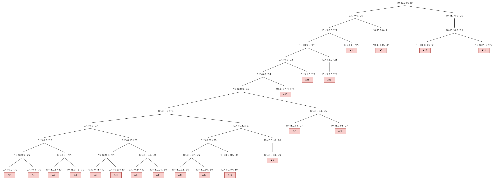
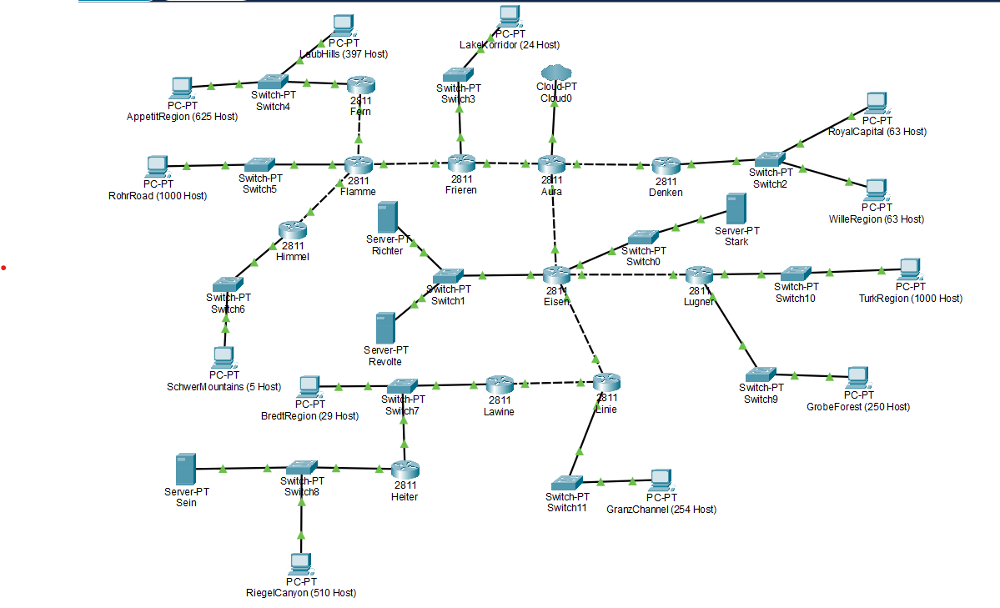
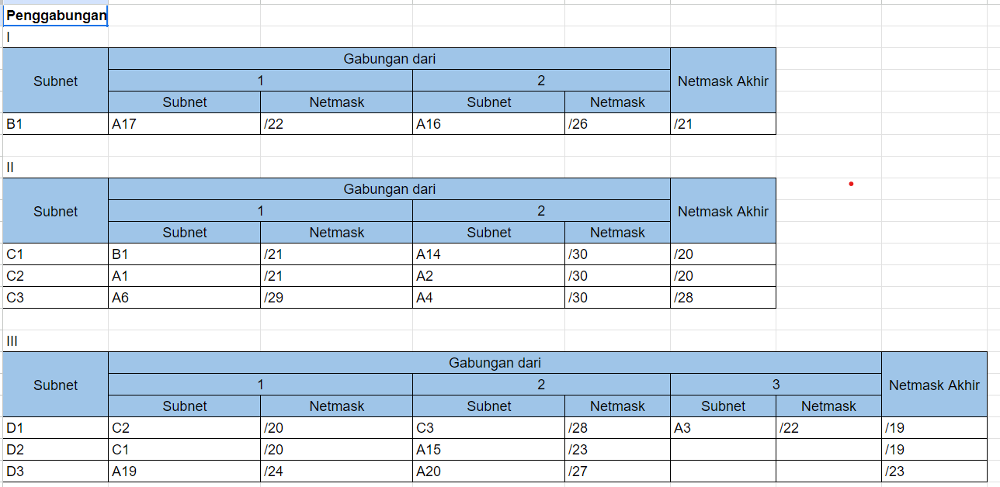
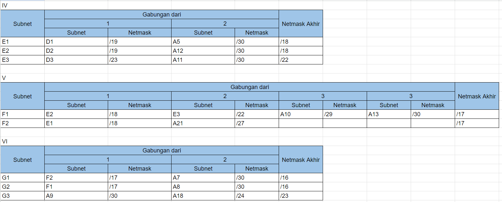
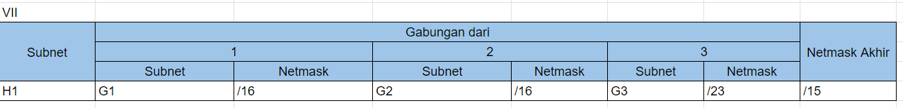
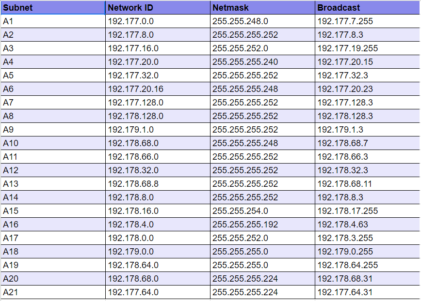

# Jarkom-Modul-4-E13-2023

| No | Nama | NRP |
|----------|----------|----------|
| 1 | Nadya Permata Sari | 5025201015 |
| 2 | Najma Ulya Agustina | 5025211239 |

<h2>Prefix IP</h2>

10.43.X.X

<h2>Soal</h2>

- Soal shift dikerjakan pada Cisco Packet Tracer dan GNS3 menggunakan metode perhitungan CLASSLESS yang berbeda.
Keterangan: Bila di CPT menggunakan VLSM, maka di GNS3 menggunakan CIDR atau sebaliknya.

- Jika tidak ada pemberitahuan revisi soal dari asisten, berarti semua soal BERSIFAT BENAR dan DAPAT DIKERJAKAN.
Untuk di GNS3 CLOUD merupakan NAT1 jangan sampai salah agar bisa terkoneksi internet.

- Pembagian IP menggunakan Prefix IP yang telah ditentukan pada modul pengenalan
  
- Pembagian IP dan routing harus SE-EFISIEN MUNGKIN.

<h2># Cisco Packet Tracer - VLSM (Variable Length Subnet Masking)</h2>

<h3>Pengelompokan Subnet</h3>

<h3>Menentukan jumlah alamat IP yang dibutuhkan oleh tiap subnet </h3>

Berdasarkan total IP dan netmask yang dibutuhkan, maka kita dapat menggunakan netmask /19 untuk memberikan pengalamatan IP pada subnet.

<h3>Dari pohon tersebut akan mendapat pembagian IP sebagai berikut</h3>

<h3>Result</h3>

<h3>Routing</h3>

<h3>Testing</h3>

<h2> GNS3 - (CIDR) Classless Inter-Domain Routing</h2>

Perhitungan pada teknik CIDR didasarkan pada jumlah komputer/ host yang ada di dalam subnet. Tetapi cara mendapatkan subnet besar tidak sama dengan VLSM. 

`Langkah 1` <h4>Menentukan subnet yang ada dalam topologi dan melakukan labelling terhadap masing-masing subnet</h4>

`Langkah 2` <h4>Penggabungan Subnet. Subnet yang digabung tersebut akan membentuk sebuah subnet lebih besar dari subnet-subnet kecil yang ada di dalamnya.</h4>

Dari proses penggabungan yang telah dilakukan, didapatkan sebuah subnet besar dengan netmask /15. Kali ini dapat menggunakan NID 192.168.0.0, netmask 255.254.0.0.

Perhitungan pembagian IP dengan pohon berdasarkan penggabungan subnet yang telah dilakukan.

Berdasarkan penghitungan, maka didapatkan pembagian IP sebagai berikut

