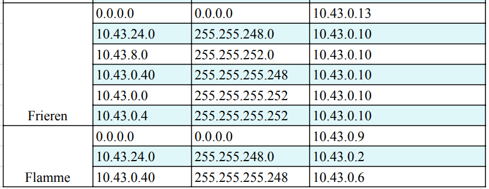
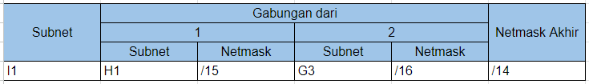

# Jarkom-Modul-4-E13-2023

| No | Nama | NRP |
|----------|----------|----------|
| 1 | Nadya Permata Sari | 5025201015 |
| 2 | Najma Ulya Agustina | 5025211239 |

<h2>Prefix IP</h2>

10.43.X.X

<h2>Soal</h2>


- Soal shift dikerjakan pada Cisco Packet Tracer dan GNS3 menggunakan metode perhitungan CLASSLESS yang berbeda.
Keterangan: Bila di CPT menggunakan VLSM, maka di GNS3 menggunakan CIDR atau sebaliknya.

- Jika tidak ada pemberitahuan revisi soal dari asisten, berarti semua soal BERSIFAT BENAR dan DAPAT DIKERJAKAN.
Untuk di GNS3 CLOUD merupakan NAT1 jangan sampai salah agar bisa terkoneksi internet.

- Pembagian IP menggunakan Prefix IP yang telah ditentukan pada modul pengenalan
  
- Pembagian IP dan routing harus SE-EFISIEN MUNGKIN.


<h2># Cisco Packet Tracer - VLSM (Variable Length Subnet Masking)</h2>


`Langkah 1`

<h3>Menentukan jumlah IP yang dibutuhkan & Plotting Subnet</h3>


- Menentuka jumlah IP


- Plotting Subnet


`Langkah 2`

<h3>Tree Pembagian IP Address & Penentuan NID, Broadcast ID</h3>

- Tree


- NID & Broadcast ID


`Langkah 3`

<h3>Pembuatan topologi dan Konfigurasi di CPT</h3>

- Topologi:
  


- Konfigurasi CPT:





**<h3>TESTING</h3>**


<h2> GNS3 - (CIDR) Classless Inter-Domain Routing</h2>

Perhitungan pada teknik CIDR didasarkan pada jumlah komputer/ host yang ada di dalam subnet. Tetapi cara mendapatkan subnet besar tidak sama dengan VLSM. 

`Langkah 1` 

<h3>Penggabungan Subnet</h3>

Subnet yang digabung tersebut akan membentuk sebuah subnet lebih besar dari subnet-subnet kecil yang ada di dalamnya

- Penggabungan 1
  


- Penggabungan 2


- Penggabungan 3


- Penggabungan 4


- Penggabungan 5


- Penggabungan 6


- Penggabungan 7


- Penggabungan 8




`Langkah 2` 

<h3>Tree Pembagian IP Address</h3>


Berdasarkan penghitungan, maka didapatkan pembagian IP sebagai berikut.


- Topologi GNS3


Konfigurasi:

- Aura
``` 
auto eth0
iface eth0 inet dhcp

auto eth1
iface eth1 inet static
	address 10.43.128.1
	netmask 255.255.255.252

auto eth2
iface eth2 inet static
	address 10.45.16.1
	netmask 255.255.255.252

auto eth3
iface eth3 inet static
	address 10.44.0.1
	netmask 255.255.255.252
```

- Denken
```
auto eth0
iface eth0 inet static
	address 10.44.1.1
	netmask 255.255.255.252

auto eth1
iface eth1 inet static
	address 10.44.0.5
	netmask 255.255.255.0
```

- Frieren
```
auto eth0
iface eth0 inet static
	address 10.43.128.2
	netmask 255.255.255.252

auto eth1
iface eth1 inet static
	address 10.43.64.1
	netmask 255.255.255.224

auto eth2
iface eth2 inet static
	address 10.43.24.1
	netmask 255.255.255.224
```

- Flamme
```
auto eth0
iface eth0 inet static
	address 10.43.24.2
	netmask 255.255.255.252

auto eth1
iface eth1 inet static
	address 10.43.16.1
	netmask 255.255.255.252

auto eth2
iface eth2 inet static
	address 10.43.4.1
	netmask 255.255.252.0

auto eth3
iface eth3 inet static
	address 10.43.0.1
	netmask 255.255.255.252
```

- Fern
```
auto eth0
iface eth0 inet static
	address 10.43.16.2
	netmask 255.255.255.252

auto eth1
iface eth1 inet static
	address 10.43.8.1
	netmask 255.255.248.0
```

- Himmel
```
auto eth0
iface eth0 inet static
	address 10.43.1.1
	netmask 255.255.255.252

auto eth1
iface eth1 inet static
	address 10.43.0.5
	netmask 255.255.255.248
```

- Eisen
```
auto eth0
iface eth0 inet static
	address 10.45.16.2
	netmask 255.255.255.252

auto eth1
iface eth1 inet static
	address 10.45.96.1
	netmask 255.255.255.248

auto eth2
iface eth2 inet static
	address 10.45.64.1
	netmask 255.255.255.252

auto eth3
iface eth3 inet static
	address 10.45.8.1
	netmask 255.255.255.252

auto eth4
iface eth4 inet static
	address 10.45.16.5
	netmask 255.255.255.252
```

- Lugner
```
auto eth0
iface eth0 inet static
	address 10.45.8.2
	netmask 255.255.255.252

auto eth1
iface eth1 inet static
	address 10.45.0.1
	netmask 255.255.252.0

auto eth2
iface eth2 inet static
	address 10.40.144.1
	netmask 255.255.255.0
```

- Linie
```
auto eth0
iface eth0 inet static
	address 10.45.64.2
	netmask 255.255.255.252

auto eth1
iface eth1 inet static
	address 10.45.40.1
	netmask 255.255.255.252

auto eth2
iface eth2 inet static
	address 10.45.48.1
	netmask 255.255.254.0
```

- Lawine
```
auto eth0
iface eth0 inet static
	address 10.45.40.2
	netmask 255.255.255.252

auto eth1
iface eth1 inet static
	address 10.45.32.1
	netmask 255.255.255.192
```

- Heiter
```
auto eth0
iface eth0 inet static
	address 10.45.32.2
	netmask 255.255.255.192

auto eth1
iface eth1 inet static
	address 10.45.36.1
	netmask 255.255.252.0
```

- Stark
```
auto eth0
iface eth0 inet static
	address 10.45.16.6
	netmask 255.255.255.252
	gateway 10.45.16.5
```

- Sein
```
auto eth0
iface eth0 inet static
	address 10.45.36.3
	netmask 255.255.252.0
	gateway 10.45.36.1
```

- Richter
```
auto eth0
iface eth0 inet static
	address 10.45.96.2
	netmask 255.255.255.248
	gateway 10.45.96.1
```

- Revolte
```
auto eth0
iface eth0 inet static
	address 10.45.96.3
	netmask 255.255.255.248
	gateway 10.45.96.1
```

- LakeKorridor
```
auto eth0
iface eth0 inet static
	address 10.43.64.2
	netmask 255.255.255.224
	gateway 10.43.64.1
```

- LaubHills
```
auto eth0
iface eth0 inet static
	address 10.43.8.2
	netmask 255.255.248.0
	gateway 10.43.8.1
```

- AppetitRegion
```
auto eth0
iface eth0 inet static
	address 10.43.8.3
	netmask 255.255.248.0
	gateway 10.43.8.1
```

- RohrRoad
```
auto eth0
iface eth0 inet static
	address 10.43.4.2
	netmask 255.255.252.0
	gateway 10.43.4.1
```

- SchwerMountain
```
auto eth0
iface eth0 inet static
	address 10.43.1.2
	netmask 255.255.255.248
	gateway 10.43.1.1
```

- RoyalCapital
```
auto eth0
iface eth0 inet static
	address 10.44.1.2
	netmask 255.255.255.0
	gateway 10.44.1.1
```

- WilleRegion
```
auto eth0
iface eth0 inet static
	address 10.44.1.3
	netmask 255.255.255.0
	gateway 10.44.1.1
```

- TurkRegion
```
auto eth0
iface eth0 inet static
	address 10.45.0.2
	netmask 255.255.252.0
	gateway 10.45.0.1
```

- GrobeForest
```
auto eth0
iface eth0 inet static
	address 10.45.4.2
	netmask 255.255.255.0
	gateway 10.45.4.1
```

- GranzChannel
```
auto eth0
iface eth0 inet static
	address 10.45.48.2
	netmask 255.255.254.0
	gateway 10.45.48.1
```

- BredtRegion
```
auto eth0
iface eth0 inet static
	address 10.45.32.2
	netmask 255.255.255.192
	gateway 10.45.32.1
```

- RiegelCanyon
```
auto eth0
iface eth0 inet static
	address 10.45.36.2
	netmask 255.255.252.0
	gateway 10.45.36.1
```

- Konfigurasi Routing


**TESTING**


